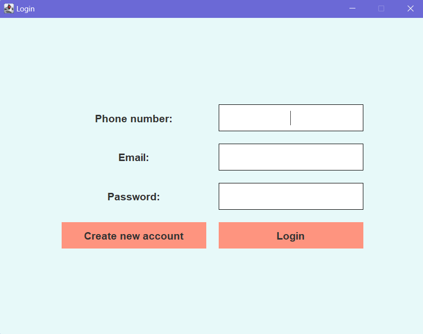
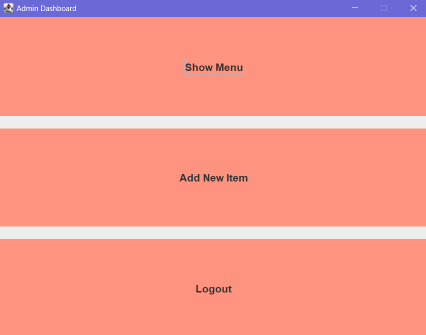
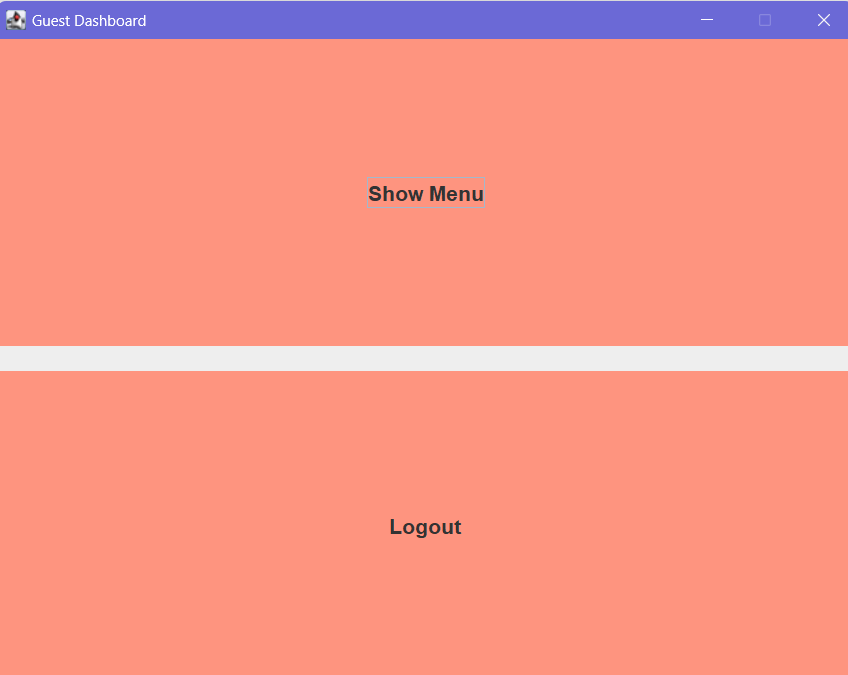
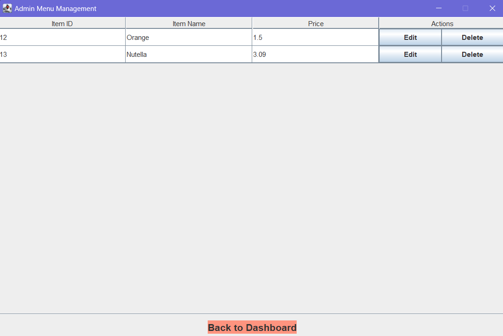
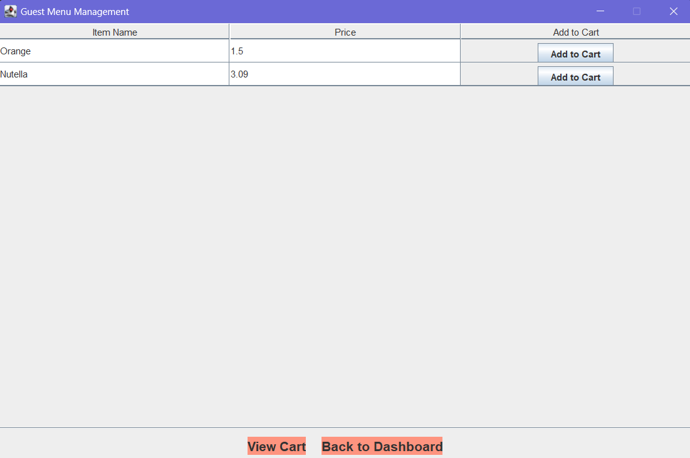
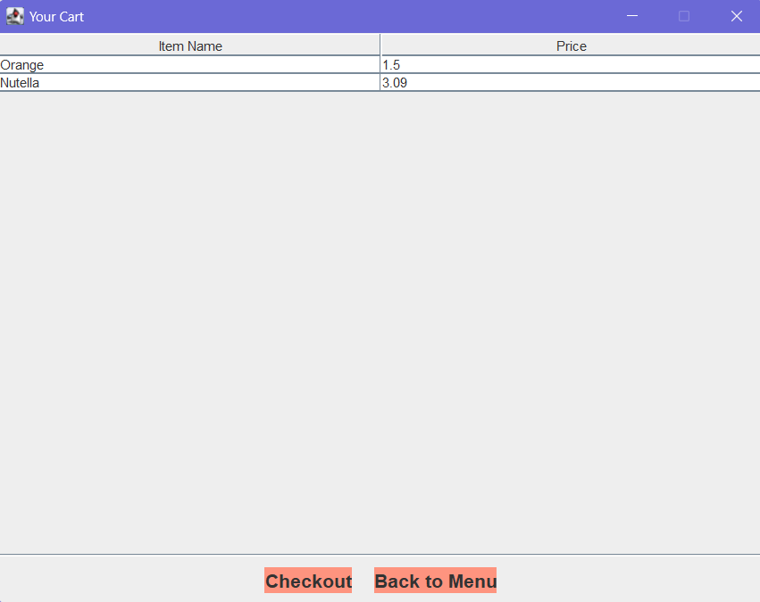
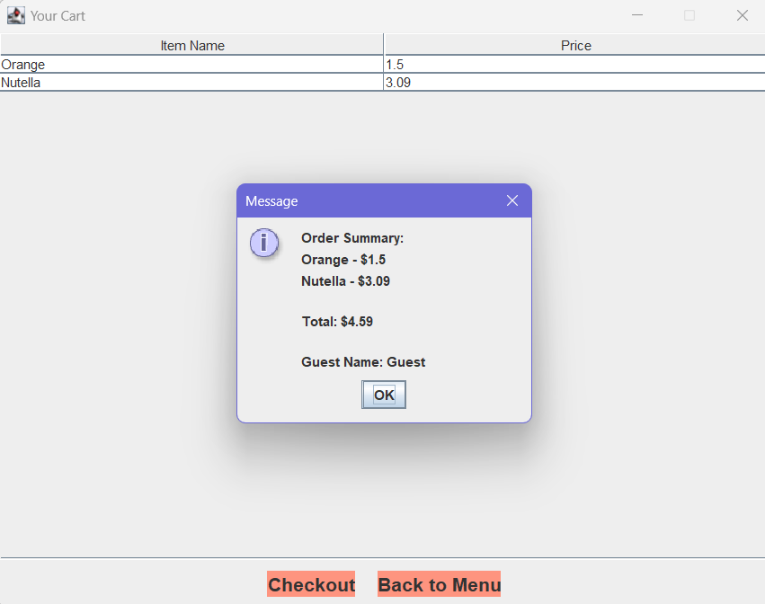

# Store Products Management System

This is a Java-based application developed as part of the **COMP830 Software Development** course. This application helps manage products in a store and supports two types of users:
- **Admin**: Manages inventory, adds, edits, and deletes items.
- **Guest**: Views items, adds items to the cart, and proceeds to checkout.

---

## Features

### Admin Features
- **Login**: Access the Admin dashboard.
- **Manage Inventory**:
  - Add new items to the product list.
  - Edit existing items.
  - Delete items.
- **View Inventory**: View a detailed list of all products.

### Guest Features
- **Login**: Access the Guest dashboard.
- **View Products**: Browse the available items in the store.
- **Add to Cart**: Add items to a shopping cart.
- **Checkout**: View the cart, proceed to checkout, and view a summary of the order.

---

## Technologies Used
- **Programming Language**: Java
- **Database**: SQLite
- **Design Pattern**: DAO (Data Access Object)
- **GUI Framework**: Swing
- 
---

## Object-Oriented Programming Concepts
- **Encapsulation**: 
  - Data fields in classes like `Account`, `Item`, and `Cart` are private, giving controlled access via getters and setters.
- **Inheritance**:
  - `Admin` and `Guest` extend the base `Account` class, inheriting common properties and methods.
- **Polymorphism**:
  - The `menu()` method is overridden by `Admin` and `Guest` to provide different functionalities.
- **Abstraction**:
  - `AccountDAO` and `ItemDAO` define abstract operations, implemented by `AccountDAOImpl` and `ItemDAOImpl`.
- **Composition**:
  - A `Guest` has a cart containing multiple items, represented by the `Cart` class.

---

## Database Schema
The project uses three main tables:
1. **Accounts**: Stores user details (Admin or Guest).
2. **Items**: Stores product details.
3. **Cart**: Tracks items added by guests.

### Database Structure
```dbml
Table Accounts {
  account_id integer [primary key, increment]
  name varchar [not null]
  phone_number integer [not null, unique]
  email varchar [not null, unique]
  password varchar [not null]
  role varchar [not null] // Admin or Guest
  created_at timestamp [default: `CURRENT_TIMESTAMP`]
}

Table Items {
  item_id integer [primary key, increment]
  name varchar [not null]
  price real [not null]
  pic varchar
  created_at timestamp [default: `CURRENT_TIMESTAMP`]
}

Table Cart {
  cart_id integer [primary key, increment]
  account_id integer [not null, ref: Accounts.account_id]
  item_id integer [not null, ref: Items.item_id]
  added_at timestamp [default: `CURRENT_TIMESTAMP`]
}
```

---

## Installation and Setup
1. **Clone the Repository**:
   ```bash
   git clone https://github.com/2024-COMP830/StoreProducts.git
   cd StoreProducts
   ```

3. **Run the Application**:
   - Run the `Main.java` file in your IDE.

4. **Database Setup**:
   - The SQLite database (`StoreManagementSystem.db`) is automatically created and initialized on the first run.

---

## Usage
### Admin
1. Login with Admin credentials.
2. Add, edit, or delete items from the menu.
3. View the full inventory list.

### Guest
1. Login with Guest credentials.
2. Browse products and add items to the cart.
3. Proceed to checkout and view the order summary.

---

## Screenshots
- Login Page
- 
- Admin Dashboard
- 
- Guest Dashboard
- 
- Admin Menu Management Page
- 
- Guest Menu Management Page
- 
- Guest Cart Page
- 
- Guest Cart Summary Page
- 

---

## Future Enhancements
- Implement search functionality for items.
- Add an analytics dashboard for Admin to track sales and inventory performance.
- Add payment options like credit/debit cards, digital wallets, and net banking.

---

## Team Members
- **Jayadeep**
- **Rishikesh**
- **Sai Saketh**

---

## Course Information
- **Course Name**: COMP830 - Software Development
- **Instructor**: Prof. Ken Gitlitz
- **Institution**: University of New Hampshire at Manchester
